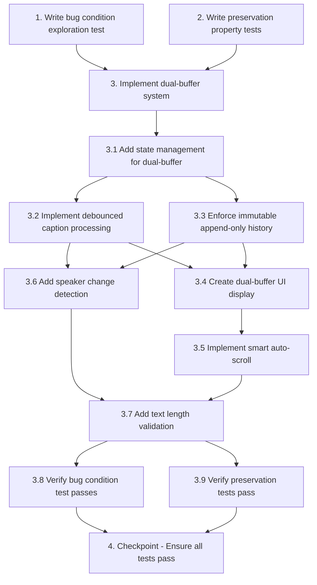

# Implementation Plan

## Overview

This implementation plan addresses critical UX issues in the Google Meet translation extension's caption management system. The bug manifests in five key scenarios: caption loss during rapid changes, speaker content mixing, history overwriting, scroll position interruption, and translation flickering. The fix implements a dual-buffer architecture (separate live and history buffers) combined with debounced translation (800-1200ms stability period) to ensure users never lose information and can read past and present captions clearly.

The implementation follows the exploratory bugfix workflow: first writing tests that fail on unfixed code to confirm the bugs exist (Property 1: Bug Condition), then writing tests that capture existing non-caption functionality to preserve (Property 2: Preservation), followed by implementing the fix with its six core components (state management, debounced processing, immutable history, dual-buffer UI, smart auto-scroll, and speaker detection), and finally validating that all tests pass.

## Context

This bugfix implements a dual-buffer system (live text + history text) with debounced translation to fix critical UX issues: captions being lost during rapid changes, speakers getting mixed together, history being overwritten, and flickering translations. The fix ensures stable, immutable history and proper speaker separation.

## Tasks

- [-] 1. Write bug condition exploration test
  - **Property 1: Bug Condition** - Caption Management UX Issues
  - **CRITICAL**: This test MUST FAIL on unfixed code - failure confirms the bugs exist
  - **DO NOT attempt to fix the test or the code when it fails**
  - **NOTE**: This test encodes the expected behavior - it will validate the fix when it passes after implementation
  - **GOAL**: Surface counterexamples that demonstrate the bugs exist
  - **Scoped PBT Approach**: Focus on deterministic reproduction of the five core bug scenarios
  - Test implementation details from Bug Condition in design:
    - Rapid caption changes (< 1000ms intervals) cause translation loss
    - Speaker transitions mix content together
    - History updates overwrite instead of append
    - User scroll position is not preserved
    - Incomplete text triggers premature translation
  - The test assertions should match the Expected Behavior Properties from design:
    - Dual-buffer display: live text buffer (changing) separate from history text buffer (immutable)
    - Debounced translation: 800-1200ms stability period before translation
    - Append-only history: new entries always added to end, never overwrite
    - Smart auto-scroll: only scroll when user is at bottom
    - Caption stability detection: text must stabilize before finalization
  - Run test on UNFIXED code
  - **EXPECTED OUTCOME**: Test FAILS (this is correct - it proves the bugs exist)
  - Document counterexamples found to understand root cause:
    - Example 1: Translation disappears when caption changes from "Hello everyone" to "Hello everyone, welcome"
    - Example 2: Speaker A and B captions get merged into single history entry
    - Example 3: New caption overwrites last history entry instead of appending
    - Example 4: User scrolled to top, new caption auto-scrolls to bottom (interrupts reading)
    - Example 5: Caption changing 3 times in 1 second triggers 3 translation API calls (flickering)
  - Mark task complete when test is written, run, and failures are documented
  - _Requirements: 1.1, 1.2, 1.3, 1.4, 1.5, 1.6, 1.7, 1.8_

- [-] 2. Write preservation property tests (BEFORE implementing fix)
  - **Property 2: Preservation** - Non-Caption Functionality
  - **IMPORTANT**: Follow observation-first methodology
  - Observe behavior on UNFIXED code for all non-caption interactions:
    - API selection (Google/Claude/OpenAI) updates storage and sends message to content script
    - Target language selection updates storage and triggers re-translation
    - Drag and drop updates translation box position in storage
    - Resize updates translation box dimensions in storage
    - Export functionality downloads JSON/TXT file with history
    - Show/hide original text toggle updates display visibility
    - Translation caching reuses identical text without new API calls
    - Speaker name display shows names and highlights changes
    - Session token validation invalidates pending translations on stop
  - Write property-based tests capturing observed behavior patterns from Preservation Requirements
  - Property-based testing generates many test cases for stronger guarantees
  - Test that for all inputs where `NOT isBugCondition(input)` holds (non-caption interactions like API selection, language selection, drag/drop, resize, export, enable/disable, show original toggle), the behavior is identical to original code
  - Run tests on UNFIXED code
  - **EXPECTED OUTCOME**: Tests PASS (this confirms baseline behavior to preserve)
  - Mark task complete when tests are written, run, and passing on unfixed code
  - _Requirements: 3.1, 3.2, 3.3, 3.4, 3.5, 3.6, 3.7, 3.8, 3.9_

- [ ] 3. Implement dual-buffer system with debounced translation

  - [~] 3.1 Add state management for dual-buffer architecture
    - Add live buffer state variables in `content.js`:
      ```javascript
      let liveCaption = { text: '', speaker: '', timestamp: null };
      let liveTranslation = '';
      let liveDebounceTimer = null;
      let captionStableTime = null;
      ```
    - Add finalization tracking to history entry structure:
      ```javascript
      // Add isFinalized: boolean to each entry in translationHistory
      ```
    - Add scroll position tracking:
      ```javascript
      let isUserAtBottom = true;
      let historyScrollContainer = null;
      ```
    - _Bug_Condition: isBugCondition(input) where input involves rapid caption changes, speaker transitions, or user scrolling_
    - _Expected_Behavior: Separate live and finalized state enables dual-buffer display and append-only history_
    - _Preservation: State variables do not affect API selection, language config, drag/resize, export functionality_
    - _Requirements: 2.1, 2.2, 2.3, 2.6, 2.8_

  - [~] 3.2 Implement debounced caption processing
    - Modify `processCaptionChange()` function to:
      - Update live buffer immediately (no translation yet)
      - Clear and restart debounce timer (800-1200ms)
      - Only trigger `finalizeCaption()` after text is stable
    - Create `finalizeCaption()` function:
      - Move current live caption to history
      - Trigger translation for finalized caption
      - Create new history entry with `isFinalized: true`
      - Clear live buffer
    - Modify `translate()` function:
      - Add session token validation to ignore old session responses
    - _Bug_Condition: isBugCondition(input) where input.type == "caption_change" AND timeSinceLastChange(input) < 1000ms_
    - _Expected_Behavior: Text only translates after stability period; no premature translation or flickering_
    - _Preservation: Translation API selection, caching, and retry logic remain unchanged_
    - _Requirements: 2.4, 1.5_

  - [~] 3.3 Enforce immutable append-only history
    - Modify `getOrCreateHistoryEntryForCaption()`:
      - Only update last entry if `isFinalized: false`
      - If last entry is finalized, always create new entry
      - Speaker comparison only matters for non-finalized entries
    - Modify `updateHistoryEntryById()`:
      - Add check to prevent updates to finalized entries
      - Log warning if attempt to modify finalized entry
    - Modify `createPendingHistoryEntry()`:
      - All new entries start with `isFinalized: false`
      - Only set to `true` by `finalizeCaption()`
    - _Bug_Condition: isBugCondition(input) where input.type == "history_update" AND historyArray.length > 0_
    - _Expected_Behavior: Finalized history entries never change; new entries always appended_
    - _Preservation: History export, size limits, and persistence remain unchanged_
    - _Requirements: 2.2, 2.6, 1.3, 1.6_

  - [~] 3.4 Create dual-buffer UI display
    - Modify `createTranslationBox()` HTML structure:
      - Add "Live Section" for current caption (top, no translation yet)
      - Add "History Section" for finalized entries (scrollable, immutable)
    - Create `updateLiveBuffer()` function:
      - Updates only live display area with current caption
      - Shows "translating..." status while debouncing
    - Create `updateHistoryBuffer()` function:
      - Appends finalized entries to history display
      - Never modifies existing history items
    - Modify `renderHistoryList()`:
      - Only render entries where `isFinalized: true`
    - _Bug_Condition: isBugCondition(input) where current caption is visible and new text arrives_
    - _Expected_Behavior: Live buffer shows changing text; history buffer shows finalized, immutable translations_
    - _Preservation: Drag/drop, resize, show/hide original text, and export UI remain unchanged_
    - _Requirements: 2.3, 2.9, 2.10, 1.2, 1.8_

  - [~] 3.5 Implement smart auto-scroll
    - Create `trackScrollPosition()` function:
      - Add scroll event listener to history container
      - Detect if user is at bottom (within 50px threshold)
      - Update `isUserAtBottom` flag
    - Modify `appendHistoryItem()` function:
      - Only auto-scroll if `isUserAtBottom === true`
      - Preserve scroll position if user scrolled up
    - Add manual scroll-to-bottom button:
      - Show button when `isUserAtBottom === false`
      - Button triggers scroll to latest entry
    - _Bug_Condition: isBugCondition(input) where input.type == "user_scroll" AND autoScrollEnabled_
    - _Expected_Behavior: Auto-scroll only when user at bottom; reading position preserved when scrolled up_
    - _Preservation: Drag/drop and resize functionality remain unchanged_
    - _Requirements: 2.7, 2.8, 1.7_

  - [~] 3.6 Add speaker change detection
    - Enhance MutationObserver callback in caption processing:
      - Detect when speaker name changes
      - Trigger immediate finalization if speaker changed and live caption has text
      - Create separate history entry for new speaker
    - _Bug_Condition: isBugCondition(input) where input.type == "speaker_change" AND previousSpeaker != currentSpeaker_
    - _Expected_Behavior: Speaker transitions create separate history entries; no mixed content_
    - _Preservation: Speaker name display and highlighting remain unchanged_
    - _Requirements: 2.1, 3.7, 1.1_

  - [~] 3.7 Add text length validation
    - In `finalizeCaption()` function:
      - Check text length against MAX_TEXT_LENGTH (500 characters)
      - Truncate text if exceeds limit: `text.substring(0, 500) + '...'`
      - Add visual indicator (e.g., ellipsis, tooltip) that text was truncated
    - _Bug_Condition: isBugCondition(input) where input.type == "long_text" AND input.text.length > 500_
    - _Expected_Behavior: Long text is truncated with clear indication; no incomplete translations_
    - _Preservation: Normal length text (<500 chars) is not truncated_
    - _Requirements: 2.5, 1.4_

  - [~] 3.8 Verify bug condition exploration test now passes
    - **Property 1: Expected Behavior** - Dual-Buffer Display with Debounced Translation
    - **IMPORTANT**: Re-run the SAME test from task 1 - do NOT write a new test
    - The test from task 1 encodes the expected behavior
    - When this test passes, it confirms the expected behavior is satisfied
    - Run bug condition exploration test from step 1
    - Verify all five bug scenarios are now fixed:
      - Rapid caption changes: old translations preserved in history buffer
      - Speaker transitions: separate history entries with correct speaker names
      - History management: new entries appended, old entries unchanged
      - Auto-scroll: user scroll position preserved when scrolled up
      - Translation timing: text stabilizes before translation (no flickering)
    - **EXPECTED OUTCOME**: Test PASSES (confirms bugs are fixed)
    - _Requirements: 2.1, 2.2, 2.3, 2.4, 2.5, 2.6, 2.7, 2.8, 2.9, 2.10_

  - [~] 3.9 Verify preservation tests still pass
    - **Property 2: Preservation** - Non-Caption Functionality
    - **IMPORTANT**: Re-run the SAME tests from task 2 - do NOT write new tests
    - Run preservation property tests from step 2
    - Verify all non-caption functionality still works identically:
      - API selection (Google/Claude/OpenAI)
      - Target language selection
      - Drag and drop positioning
      - Resize functionality
      - History export (JSON/TXT)
      - Show/hide original text toggle
      - Translation caching
      - Speaker name display
      - Session token validation
    - **EXPECTED OUTCOME**: Tests PASS (confirms no regressions)
    - Confirm all tests still pass after fix (no regressions)
    - _Requirements: 3.1, 3.2, 3.3, 3.4, 3.5, 3.6, 3.7, 3.8, 3.9_

- [~] 4. Checkpoint - Ensure all tests pass
  - Run complete test suite (exploration + preservation tests)
  - Verify all tests pass
  - If any test fails, diagnose and fix the issue
  - Perform manual testing in real Google Meet session:
    - Join a call with multiple speakers
    - Observe live buffer updates as captions change
    - Verify translations appear after stability period
    - Check history accumulates without losing entries
    - Test scroll position preservation
    - Confirm no flickering or premature translations
    - Validate speaker transitions create separate entries
  - Ask the user if questions arise or if additional testing is needed

## Notes

- The dual-buffer architecture separates "live, changing" content from "finalized, historical" content
- Debounced translation (800-1200ms) prevents wasted API calls and flickering
- Append-only history ensures users never lose information
- Smart auto-scroll respects user reading position
- Speaker change detection triggers immediate finalization for proper separation

## Task Dependency Graph



```json
{
  "waves": [
    {
      "id": 1,
      "tasks": ["1", "2"],
      "description": "Exploration and Preservation Testing - Write tests on unfixed code to confirm bugs and establish baseline behavior"
    },
    {
      "id": 2,
      "tasks": ["3.1"],
      "description": "State Management - Establish dual-buffer state variables and tracking mechanisms"
    },
    {
      "id": 3,
      "tasks": ["3.2", "3.3"],
      "description": "Core Logic - Implement debounced processing and immutable history (parallel)"
    },
    {
      "id": 4,
      "tasks": ["3.4"],
      "description": "UI Display - Create dual-buffer UI with live and history sections"
    },
    {
      "id": 5,
      "tasks": ["3.5", "3.6"],
      "description": "UX Enhancements - Add smart auto-scroll and speaker change detection (parallel)"
    },
    {
      "id": 6,
      "tasks": ["3.7"],
      "description": "Text Validation - Add text length handling and truncation"
    },
    {
      "id": 7,
      "tasks": ["3.8", "3.9"],
      "description": "Verification - Confirm bug fixes and preservation (parallel)"
    },
    {
      "id": 8,
      "tasks": ["4"],
      "description": "Final Checkpoint - Complete test suite validation and manual testing"
    }
  ]
}
```

### Dependency Explanation

**Sequential Dependencies:**
- **Task 1 (Bug Condition Test) → Task 3 (Implementation)**: The bug condition exploration test must be written first to confirm the bugs exist on unfixed code, then the implementation can proceed to fix them.
- **Task 2 (Preservation Tests) → Task 3 (Implementation)**: The preservation tests must be written first to establish baseline behavior on unfixed code, ensuring the fix doesn't introduce regressions.
- **Task 3.1 (State Management) → Tasks 3.2, 3.3**: State variables for live buffer, finalization tracking, and scroll position must exist before implementing debounced processing and history management.
- **Tasks 3.2, 3.3 → Task 3.4 (UI Display)**: Debounced processing and immutable history logic must be in place before creating the dual-buffer UI that displays them.
- **Task 3.4 (UI Display) → Task 3.5 (Auto-Scroll)**: The dual-buffer UI structure must exist before implementing smart auto-scroll on the history buffer.
- **Tasks 3.2, 3.3 → Task 3.6 (Speaker Detection)**: Debounced processing and history management must be functional before adding speaker change detection that triggers immediate finalization.
- **Tasks 3.5, 3.6 → Task 3.7 (Text Length)**: Auto-scroll and speaker detection must be complete before adding text length validation as the final processing step.
- **Task 3.7 → Tasks 3.8, 3.9 (Verification)**: All implementation must be complete before running verification tests.
- **Tasks 3.8, 3.9 → Task 4 (Checkpoint)**: Both bug condition and preservation tests must pass before final checkpoint.

**Parallel Opportunities:**
- **Tasks 3.2 and 3.3** can be implemented in parallel after 3.1, as debounced processing and history management are independent logic areas.
- **Tasks 3.8 and 3.9** can be executed in parallel, as they verify independent test suites (bug condition vs preservation).

**Critical Path**: Task 1 → Task 3 → Task 3.1 → Task 3.2 → Task 3.4 → Task 3.5 → Task 3.7 → Task 3.8 → Task 4

This path represents the minimum sequential steps required to implement the fix, as each task depends on the completion of the previous one. The critical path ensures that state management is established first, then debounced processing, then UI display, then auto-scroll, then text validation, followed by verification and final checkpoint.
